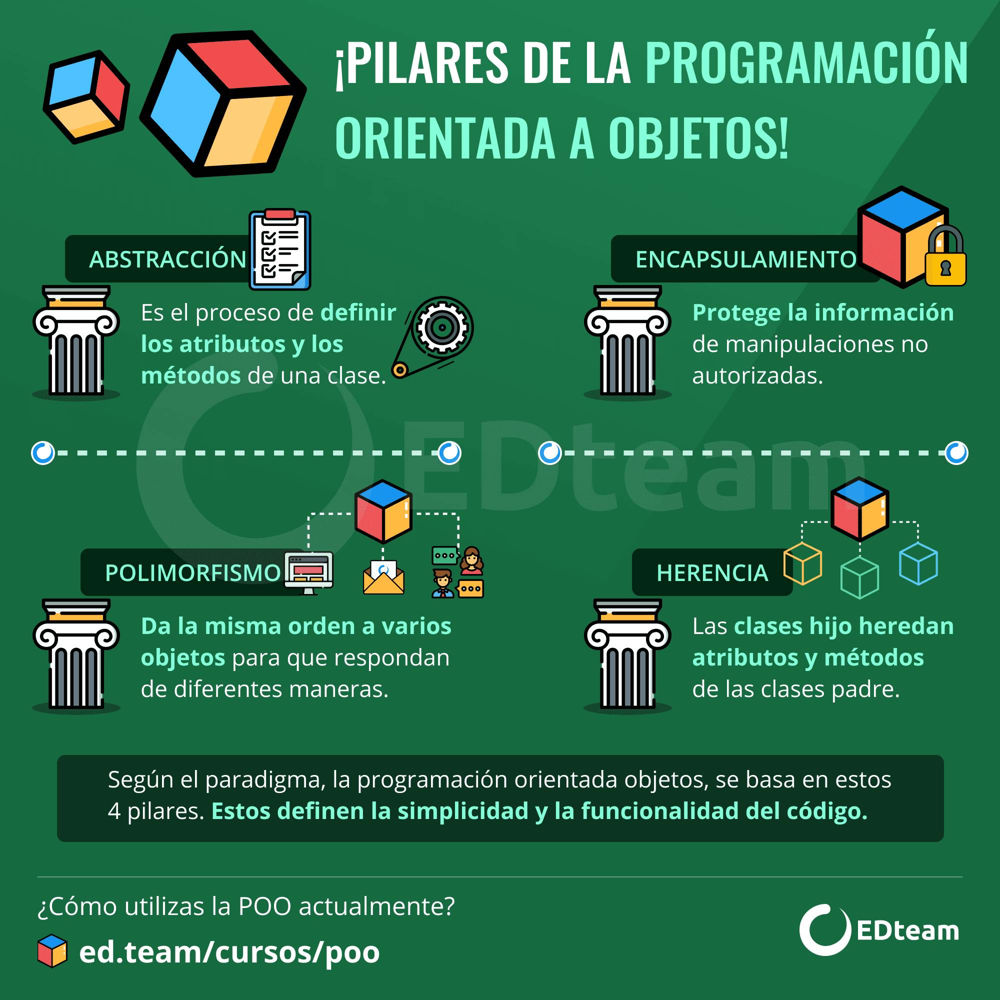
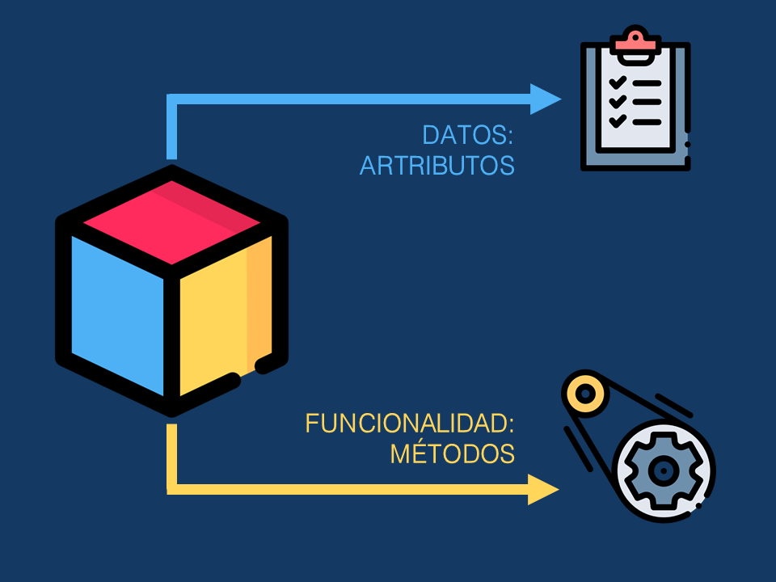
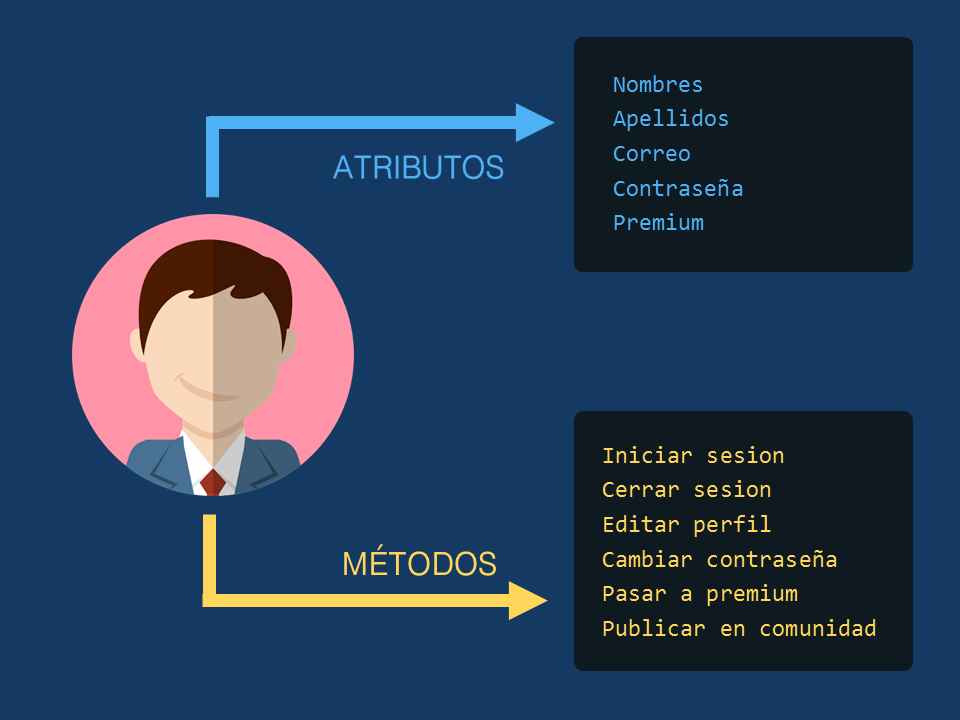

# Programación Orientada a Objetos (en Python)
A continuación vamos a presentar una guía sobre Programación Orientada a Objetos con Python 3.
# Introducción

## 1) Pilares de la POO
> 

- - -
## 2) ¿Qué es la POO?
> 

- - -
## 3) ¿Qué es un objeto?
> 

### 3.1) Creemos una clase y sus objetos
```python
class Usuario(): # Esta es la clase
    nombre = "name"
    apellido = "last_name"
    edad = 25
    nacionalidad = "Argentina"

usuario1 = Usuario() # Este es un objeto
usuario2 = Usuario() # Este es otro...

print(type(usuario1))
print(type(usuario2))
```
### 3.2) ¿Cómo vemos nuestros objetos?
```python
# Cambiar nombre y ver que pasa
print(usuario1.nombre) # Este es un objeto
print(usuario2.nombre) # Este es otro...
```

- - -
## 4) Métodos y Atributos
> 

### 4.1) ¿Cómo serian para un usuario?
* Los **atributos** se implementan con **variables**.
* Y los **métodos** con **funciones**.
> 

### 4.2) Creemos algunos atributos.
```python
class Usuario(): # Esta es la clase

    nacionalidad = "Argentina"

    def __init__(self,miNombre,miApellido,miEdad):
        self.nombre = miNombre
        self.apellido = miApellido
        self.edad = miEdad

usuario1 = Usuario("Lucas","Trubiano",23) # Este es un objeto
usuario2 = Usuario("Python","POO",3) # Este es otro...

print(usuario1.nombre) # Acceder a un atributo, desde afuera
print(usuario2.nombre) # Acceder a un atributo, desde afuera
```

### 4.3) Creemos algún método.
```python
class Usuario(): # Esta es la clase

    nacionalidad = "Argentina"

    def __init__(self,miNombre,miApellido,miEdad):
        self.nombre = miNombre
        self.apellido = miApellido
        self.edad = miEdad
    
    def mePresento(self):
        # Notar como acceder a un atributo, desde adentro
        print("Mi nombre es",self.nombre,self.apellido,f"y tengo {self.edad} años")

usuario1 = Usuario("Lucas","Trubiano",23) # Este es un objeto
usuario2 = Usuario("Python","POO",3) # Este es otro...

usuario1.mePresento() # Acceder a un metodo
usuario2.mePresento() # Acceder a un metodo
```

- - -
## 5) Para cerrar...
Cada **objeto** es una **instancia** de una **clase** que tienen *atributos* y *métodos* en común. Aunque cada objeto es particular.

> 